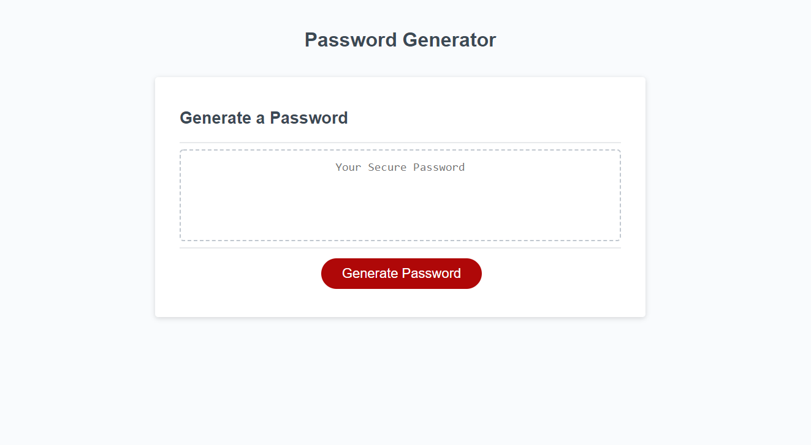

# Password Generator

## Description

For this project I was tasked with creating a password generator. We accomplish this by using a fuction to generate a random password dependant on user inputs. I started by creating constants with all possible characters to be used classified by what they are (upper case, lower case, special characters, and numbers). As well as finding the generate id for a button within the HTML. A function already exsisted in the file to write the generated password to the HTML whenever the button was clicked. Within this function it calls another function that generates the password to be written based on the used inputs. The function begins with prompting the user asking for the length they want the password to be, followed by an if statement that insures the password is at least 8 characters long and less that 128 characters. Followed by four confirm actions to check which characters to include. This then is tested to make sure at least one of the responses is returned true inorder to generate a password. If all of these returned false there would be no characters selected to be used. An array is used to store the random character generators for each type. Using this and the user inputs of the confirm actions it is then tested which are true or false to determine what bits of the array to include. When a character type is returned false it will remove that generator function from the array to disable the use of that character type. Finally with all the information we are able to feed it into a if loop with a blank string to be filled to the length the user selected for the password. This is then turned into a string just incase the user selects only numbers to be used, and returned to the write function to fill the display on the page.

A struggle that I came across when creating this project was using the user input of what characters they want in the password to determine what should be used to generate the password. My first attempts used different variables to activate different strings to generate the password. However password would end up with mostly numbers and only one of each of the other characters. I finally decided to remove that functionality and used if statements to check if the inputs were true or false. When they return false I simply splice the array index that generates the character that was returned false. This works way better than my initial idea and is created with cleaner code in the function.

## Links
[Deployed-Site](https://niklasertle.github.io/nje-password-gen/)

